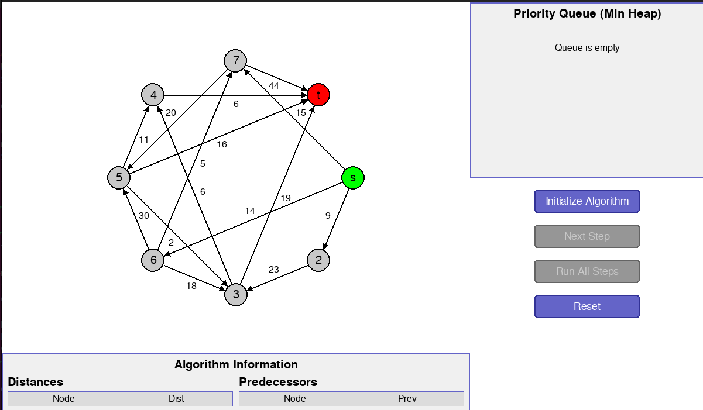
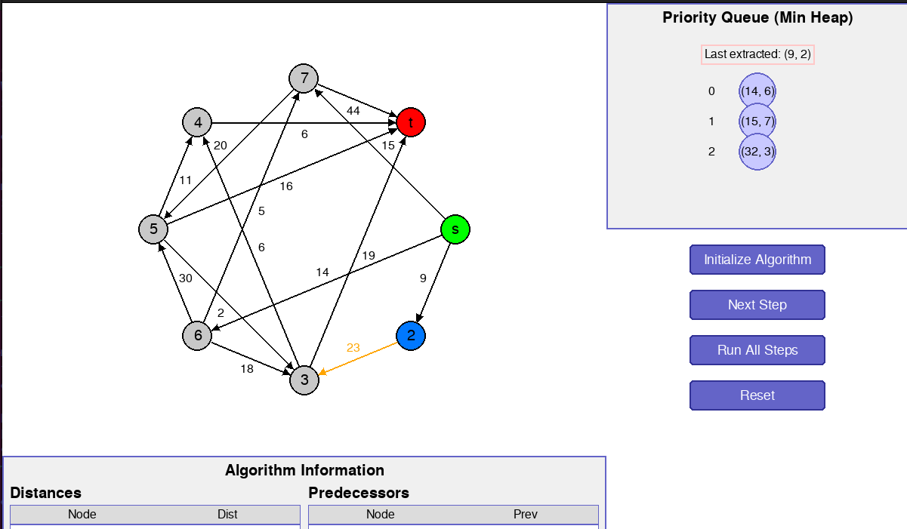
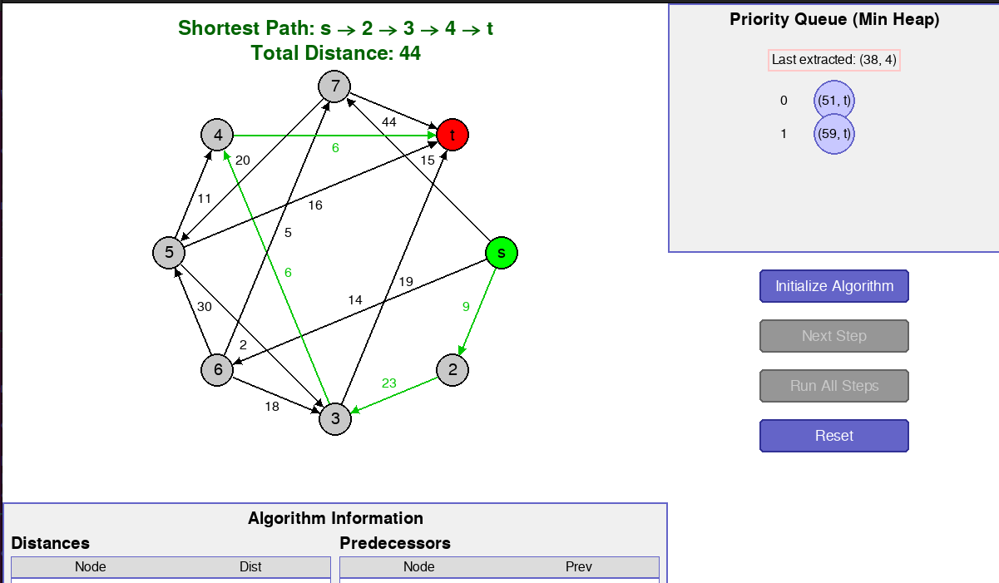

# Dijkstra Algorithm Visualization

**Número da Lista**: 1  
**Conteúdo da Disciplina**: Grafos 2  

## Alunos
|Matrícula | Aluno |
| -- | -- |
| 22/2021933  |  William Bernardo da Silva |
| 22/2015195  |  Mateus de Castro Santos |

## Sobre 
Este projeto é uma aplicação educacional interativa que visualiza passo a passo a execução do algoritmo de Dijkstra em um grafo dirigido e ponderado. A interface mostra graficamente o grafo, os caminhos testados, o funcionamento da fila de prioridade (heap de mínimo), e o progresso da busca.

## Instalação 
Para executar este projeto, você precisará ter o Python 3.x instalado, além da biblioteca Pygame.

```bash
# Clone o repositório
git clone https://github.com/seu-usuario/Dijkstra_Visualization.git

# Crie um ambiente virtual
python3 -m venv venv

# Ative o ambiente virtual
source venv/bin/activate

# Instale as dependências
pip install -r requirements.txt

# Entre na pasta do projeto
cd Dijkstra_Visualization
```

## Uso 
Para executar a aplicação, utilize o comando:

```bash
python main.py
```

### Controles:
- **Iniciar Algoritmo**: Começa a visualização do algoritmo de Dijkstra
- **Próximo passo**: Avança para o próximo passo do algoritmo (modo manual)
- **Executar tudo**: Executa o algoritmo completo com delay entre os passos
- **Resetar**: Reinicia a visualização com o mesmo grafo

## Screenshots

### Home


### Execução de um passo


### Execução total


## Outros

**Vídeo de apresentação:** [Link do vídeo](https://www.youtube.com/watch?v=snPnqs9edNI)